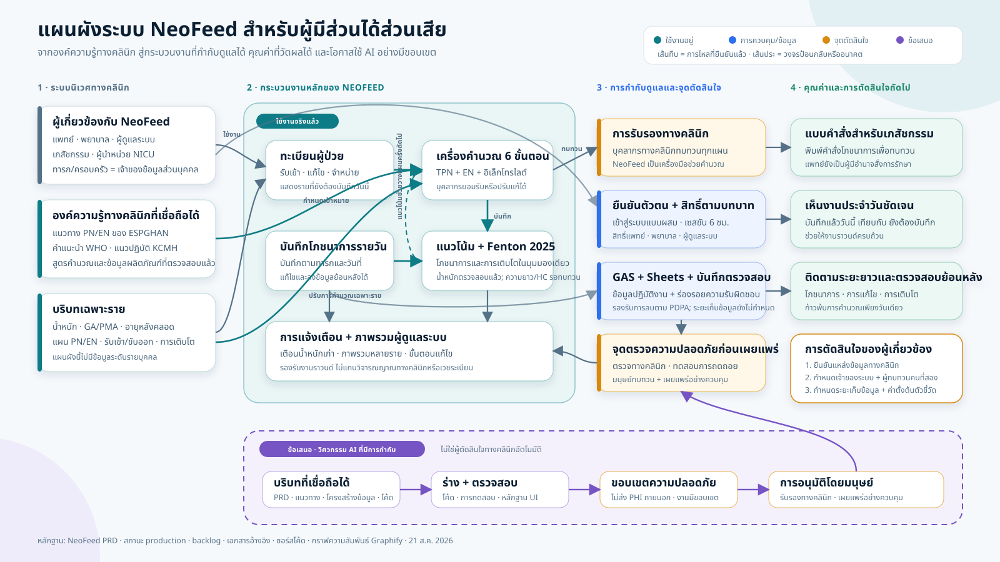

# แผนผัง NeoFeed สำหรับผู้มีส่วนได้ส่วนเสีย

## สารหลัก

NeoFeed ไม่ได้เป็นเพียงเครื่องคำนวณ แต่เป็นกระบวนงานทางคลินิกที่มีการกำกับดูแล เชื่อมโยงองค์ความรู้
ด้านโภชนาการที่เชื่อถือได้ บริบทเฉพาะราย งานประจำวันใน NICU การติดตามระยะยาว และร่องรอยข้อมูล
ที่ตรวจสอบได้ คุณค่าของระบบขึ้นอยู่กับการมีบุคลากรทางคลินิกอยู่ในทุกจุดตัดสินใจสำคัญ

## วิธีนำเสนอแผนผัง

อ่านจากซ้ายไปขวา:

1. **ระบบนิเวศทางคลินิก:** บุคลากร แนวทางทางคลินิก และบริบทเฉพาะรายเข้าสู่ระบบ
2. **กระบวนงานหลักของ NeoFeed:** ทะเบียนผู้ป่วย เครื่องคำนวณ 6 ขั้นตอน บันทึกรายวัน กราฟการเติบโต
   และการแจ้งเตือน เปลี่ยนข้อมูลนำเข้าให้เป็นกระบวนงานประจำวันที่ทำซ้ำได้อย่างเป็นระบบ
3. **การกำกับดูแลและจุดตัดสินใจ:** การยืนยันตัวตน สิทธิ์ตามบทบาท การตรวจสอบย้อนหลัง การคุ้มครอง
   ข้อมูลตาม PDPA การทดสอบ และการรับรองโดยมนุษย์ ป้องกันไม่ให้ระบบกลายเป็นผู้สั่งการรักษาอัตโนมัติ
4. **คุณค่า:** แบบคำสั่งสำหรับเภสัชกรรม การเห็นภาระงานของวันนี้ และบันทึกโภชนาการกับการเติบโต
   แบบต่อเนื่อง
5. **ข้อเสนอการใช้ AI ในงานวิศวกรรม:** AI อาจช่วยดูแลและตรวจสอบ NeoFeed แต่ต้องใช้เฉพาะบริบท
   ที่ได้รับอนุมัติ ไม่ส่งข้อมูลที่ระบุตัวทารกไปยังโมเดลภายนอก และห้ามอนุมัติแผนการรักษาหรือ
   การเผยแพร่ขึ้น production

## บทพูด 60 วินาที

“NeoFeed เริ่มจากสามสิ่ง ได้แก่ บุคลากรที่ทำงานจริง องค์ความรู้ด้านโภชนาการทารกแรกเกิดที่เชื่อถือได้
และบริบทเฉพาะราย แอปเปลี่ยนสิ่งเหล่านี้ให้เป็นกระบวนงานประจำวัน ตั้งแต่ดูว่าใครยังต้องบันทึก
คำนวณแผน PN และ EN บันทึกข้อมูล ไปจนถึงติดตามโภชนาการและการเติบโตตามเวลา ชั้นสีน้ำเงินและสีส้ม
คือสิ่งที่ทำให้เราพูดถึง NeoFeed ในฐานะผลิตภัณฑ์ทางคลินิกได้อย่างรับผิดชอบ เพราะแพทย์ยังเป็นผู้มีอำนาจ
สั่งการรักษา การเข้าถึงถูกควบคุมตามบทบาท ทุกการกระทำตรวจสอบย้อนหลังได้ และการเผยแพร่ต้องผ่าน
การทบทวนโดยมนุษย์ คุณค่าจึงไม่ใช่เพียงการคำนวณเร็วขึ้น แต่คือกระบวนงานโภชนาการที่มองเห็นได้
ตรวจสอบได้ และทำซ้ำได้อย่างเป็นระบบ AI สามารถช่วยร่างการเปลี่ยนแปลงและรันการทดสอบในวงจรวิศวกรรม
แต่ต้องอยู่นอกการตัดสินใจสั่งการรักษา สิ่งที่ต้องการจากผู้มีส่วนได้ส่วนเสียคือ การยืนยันแหล่งข้อมูล
ทางคลินิก การกำหนดเจ้าของระบบที่ยั่งยืน นโยบายเก็บรักษาข้อมูล และข้อตกลงเรื่องตัวชี้วัดผลิตภัณฑ์ชุดแรก”

## คำถามปิดการนำเสนอ

- **ด้านคลินิก:** แหล่งข้อมูลและความเข้มข้นของสารละลายที่ใช้จริงได้รับการรับรองอย่างเป็นทางการหรือยัง
- **เจ้าของระบบ:** ใครเป็นเจ้าของ NeoFeed และใครเป็นผู้ทบทวนด้านคลินิกหรือเทคนิคคนที่สอง
- **การกำกับดูแล:** ควรเก็บข้อมูลหลังจำหน่ายนานเท่าใด และใครมีอำนาจอนุมัติการลบ
- **คุณค่า:** จำนวนผู้ใช้รายสัปดาห์ ความครอบคลุมของบันทึกรายวัน และอัตราการลงข้อมูลย้อนหลัง
  ให้ค่าตั้งต้นอย่างไร
- **ขอบเขต AI:** งานดูแลระบบใดให้ AI ช่วยได้ และข้อมูลหรือการกระทำใดต้องห้ามเสมอ

## คำอธิบายสีและสถานะหลักฐาน

- สีเขียวอมฟ้า = ความสามารถที่ NeoFeed ใช้งานอยู่ในปัจจุบัน
- สีน้ำเงิน = การควบคุมความน่าเชื่อถือหรือข้อมูลที่ใช้อยู่ในปัจจุบัน
- สีส้ม = จุดตัดสินใจโดยมนุษย์หรือประเด็นที่ผู้มีส่วนได้ส่วนเสียยังต้องตัดสินใจ
- สีม่วงและเส้นประสีม่วง = ข้อเสนอในอนาคต ไม่ใช่พฤติกรรมของระบบ production ปัจจุบัน
- แผนผังนี้ไม่มีข้อมูลระดับรายบุคคล
